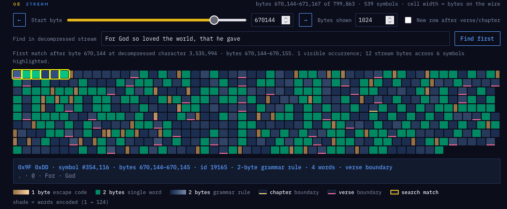

# RPR1 — a generic Re-Pair word codec



RPR1 is a dependency-free TypeScript implementation of the text compression scheme used by the
1993 Game Boy KJV, generalized so the reserved single-byte range is configurable. It runs in Node
and the browser and includes an interactive demo for exploring how text is encoded.

For the codec pipeline, format design, algorithm trade-offs, experiments, and benchmarks, see
[DETAILS.md](DETAILS.md).

[ public demonstration is published to GitHub pages](https://danwatt.github.io/repair-compress-demo/demo.html).

Sources:
* [Decoding text compression on a Game Boy](https://www.danwatt.org/2024/10/decoding-text-compression-on-a-gameboy/)
* [Compressing a Word List on 1980's Hardware](https://www.danwatt.org/2023/11/compressing-a-word-list-on-1980s-hardware/)

## Project layout

| File                                            | What it is                                                          |
|-------------------------------------------------|---------------------------------------------------------------------|
| `repair-codec.ts`                               | The codec library.                                                  |
| `repair-codec.test.ts`                          | Round-trip tests across the configuration space, plus a timing run. |
| `link-codec.ts`                                 | YLK1, a next-occurrence link codec after US 5,153,831.              |
| `link-codec.js`                                 | Browser bundle of `link-codec.ts`, generated by `mise run build`.   |
| `kjv-suffixes.js`                               | Precomputed YLK1 lexicon ending table for the browser demo.         |
| `link-codec.bench.ts`                           | YLK1 round-trip and search checks, and the RPR1 head-to-head.       |
| `demo.html`                                     | Interactive browser demo for inspecting encoded text byte by byte.  |
| `demo-ylk1.html`                                | Interactive browser demo for YLK1: chain view, chase, and search.   |
| `kjv.csv`                                       | Full King James Bible source data, one verse per row.               |
| `kjv-data.js` / `kjv-preencoded.js`             | Generated browser data used by the demo.                            |
| `build-kjv-data.js` / `build-kjv-preencoded.ts` | Scripts that regenerate the browser data.                           |
| `mise.toml`                                     | Pinned Node version and development tasks.                          |

## Development

Everything goes through [mise](https://mise.jdx.dev), which pins Node and manages the underlying
`npm` and `npx` commands. From the repository root:

```sh
mise run serve            # build, then serve the demo at http://localhost:8080
mise run test             # run round-trip tests and the timing run
mise run bench-link       # check YLK1 and compare it to RPR1 on the KJV
mise run build            # bundle repair-codec.ts for the browser
mise run data             # regenerate browser data from kjv.csv
mise run clean            # remove generated build output
```

Run `mise tasks` to list all available tasks. After starting the server, open
<http://localhost:8080/demo.html>; browsers will not load the demo correctly over `file://`.

`demo.html` and `demo-ylk1.html` are hand-edited. After changing `repair-codec.ts` or
`link-codec.ts`, run `mise run build` to regenerate `repair-codec.js` and `link-codec.js`. The build
and data tasks use mise source/output tracking and skip unchanged work.

## YLK1

`link-codec.ts` implements a different scheme from the same era: the storage format in
[US 5,153,831](https://patents.google.com/patent/US5153831A/en), filed 1990 by Peter N. Yianilos for
Franklin Electronic Publishers. A searchable word is never written into the stream — each occurrence
stores only the distance forward to the next occurrence of the same word, and the last one stores
the lexicon row. The stream is therefore both the text and its inverted index.

On the full KJV it reaches 1,100,776 bytes with search included, against 958,460 for RPR1 with no
search at all; adding a conventional inverted index to RPR1 costs 501,951 bytes, which puts YLK1
24.6% below the pair. `mise run bench-link` reproduces those numbers and verifies the round trip and
every lexicon word's search results. `demo-ylk1.html` visualizes the chains.

The lexicon is packed with the same suffix table and header codebook `repair-codec.ts` uses, so the
two codecs differ only in how their streams work. Planning that ending table is the slowest part of
an encode and depends only on the corpus, so `LinkConfig.suffixes` accepts a table from
`planSuffixes()` — reuse costs at most a few dozen bytes and cuts encode time by two thirds.
